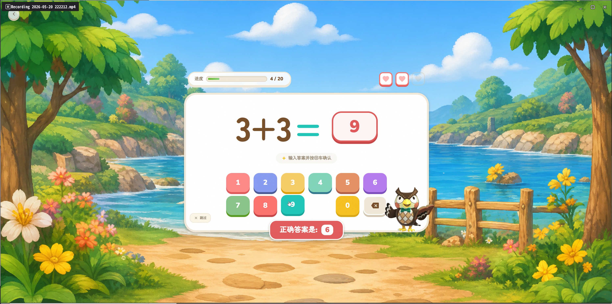
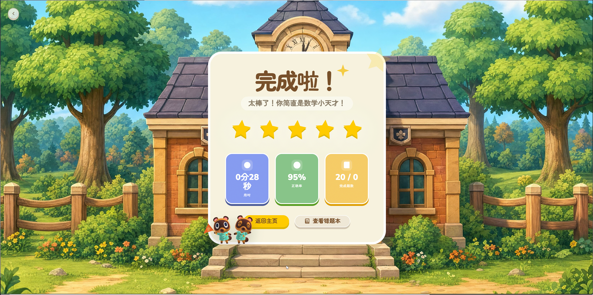

# KidsMathQuest

<div align="center">


**一个给小学生练习加减乘除的web应用，可以定制化自动生成计算题练习。随便靠AI把前端做的好看点，就是为了能让孩子能每天多练几题……**

[](https://hub.docker.com/r/bllxk/kidsmathquest-backend)
[](https://react.dev)
[](https://nodejs.org)
[](LICENSE)


</div>

## 项目介绍

KidsMathQuest 是一个面向 6-12 岁儿童的数学学习应用，采用**家长端 + 儿童端**双端分离设计：

- **家长端**：管理孩子信息、定制每日练习、生成可打印试卷、追踪学习进度
- **儿童端**：沉浸式答题体验、虚拟键盘支持、即时反馈、徽章激励系统

设计风格灵感来自《动物森友会》，采用温暖柔和的配色与圆润可爱的 UI 元素，让学习像游戏一样有趣。

## 功能预览

### 家长端功能

<!-- [TODO: 家长端仪表盘截图] -->
<!-- 图片位置：screenshots/parent-dashboard.png -->
<!-- 建议内容：登录后显示的孩子列表和今日练习状态 -->
<!-- (暂未提供) -->

| 功能模块 | 说明 |
|---------|------|
| 儿童管理 | 添加、编辑、管理多个孩子的学习档案 |
| 练习配置 | 自定义每日题目数量、难度范围、运算类型 |
| 试卷生成 | 自动生成 A4 数学试卷，支持打印 |
| 学习统计 | 正确率分析、连续打卡天数、历史记录追踪 |

### 儿童端功能



| 功能模块 | 说明 |
|---------|------|
| 每日练习 | 根据家长配置自动生成题目，支持虚拟键盘输入 |
| 即时反馈 | 答对/答错动画反馈，答错自动收录至错题本 |
| 结算领奖 | 完成练习后领取积分，连续打卡有额外奖励 |
| 徽章系统 | 达成成就解锁徽章，激励持续学习 |
| 错题复习 | 针对性复习历史错题，巩固薄弱环节 |

### 应用截图

<div align="center">


*登录页面*


*练习结果与奖励*

<!-- [TODO: 试卷打印页截图] -->
<!-- 图片位置：screenshots/paper-print.png -->
<!-- 建议内容：试卷生成与打印预览界面 -->
<!-- (暂未提供) -->

</div>

## 技术架构

### 系统架构图

```
┌─────────────────────────────────────────────────────────────────┐
│                         用户浏览器                               │
│                   (Chrome / Safari / Edge)                      │
└─────────────────────────────┬───────────────────────────────────┘
                              │ HTTP
                              ▼
┌─────────────────────────────────────────────────────────────────┐
│                      Nginx 反向代理                              │
│                    (容器端口 80:3000)                            │
└─────────────────────────────┬───────────────────────────────────┘
                              │
                              ▼
┌─────────────────────────────────────────────────────────────────┐
│                    React 前端应用                                │
│  ┌──────────────────────────────────────────────────────────┐  │
│  │  React 18 + TypeScript + Vite + Tailwind CSS           │  │
│  │  动物森友会风格 UI (animal-island-ui)                   │  │
│  │  ┌──────────┐  ┌──────────┐  ┌──────────┐            │  │
│  │  │ 家长端   │  │ 儿童端   │  │ 共享组件 │            │  │
│  │  └──────────┘  └──────────┘  └──────────┘            │  │
│  └──────────────────────────────────────────────────────────┘  │
└─────────────────────────────┬───────────────────────────────────┘
                              │ REST API
                              ▼
┌─────────────────────────────────────────────────────────────────┐
│                    Node.js 后端 API                               │
│  ┌──────────────────────────────────────────────────────────┐  │
│  │  Express + TypeScript + JWT + bcryptjs                  │  │
│  │  ┌─────────────┐  ┌─────────────┐  ┌─────────────┐    │  │
│  │  │ Controllers │  │  Services   │  │ Middleware  │    │  │
│  │  └─────────────┘  └─────────────┘  └─────────────┘    │  │
│  └──────────────────────────────────────────────────────────┘  │
└─────────────────────────────┬───────────────────────────────────┘
                              │ Prisma ORM
                              ▼
┌─────────────────────────────────────────────────────────────────┐
│                    数据库层                                       │
│  ┌─────────────────┐  ┌─────────────────┐                    │  │
│  │  SQLite (本地)  │  │ PostgreSQL     │                    │  │
│  │  - 开发环境     │  │  - 生产环境    │                    │  │
│  │  - Docker Volume│  │  - Cloud Profile│                  │  │
│  └─────────────────┘  └─────────────────┘                    │  │
└─────────────────────────────────────────────────────────────────┘
```

### 数据流示意图

```
家长端流程：
┌──────────┐    注册/登录    ┌──────────┐    添加儿童    ┌──────────┐
│  浏览器  │ ─────────────▶ │ 后端API  │ ────────────▶ │  数据库  │
└──────────┘                └──────────┘                └──────────┘
     │                           │                           │
     │    配置练习题目            │                           │
     └───────────────────────────▶                           │
     │                           │                           │
     │    查看学习统计            │                           │
     └───────────────────────────▶                           │

儿童端流程：
┌──────────┐    儿童登录     ┌──────────┐    获取题目    ┌──────────┐
│  浏览器  │ ─────────────▶ │ 后端API  │ ────────────▶ │  数据库  │
└──────────┘                └──────────┘                └──────────┘
     │                           │                           │
     │    提交答案                │                           │
     └───────────────────────────▶                           │
     │                           │                           │
     │    记录结果/解锁徽章        │                           │
     └───────────────────────────▶                           │
```

**前端技术栈**
- React 18 + TypeScript + Vite
- Tailwind CSS 响应式布局
- 动物森友会风格 UI（animal-island-ui）
- Lucide 图标库

**后端技术栈**
- Node.js 18 + Express + TypeScript
- Prisma ORM + SQLite（本地）/ PostgreSQL（云端）
- JWT 身份认证
- bcryptjs 密码加密

**部署方式**
- Docker + Docker Compose 一键部署
- Docker Hub 镜像托管
- 跨平台支持（Windows / macOS / Linux）

### 部署流程图

```
┌─────────────────────────────────────────────────────────────────┐
│                      部署流程                                     │
└─────────────────────────────────────────────────────────────────┘

方式一：Docker Hub 镜像部署（推荐）
┌──────────┐    git clone    ┌──────────┐    docker-compose up    ┌──────────┐
│ 开发者   │ ─────────────▶ │ 服务器   │ ─────────────────────▶ │  运行中   │
└──────────┘                └──────────┘                          └──────────┘
                                │
                                │ docker pull (自动)
                                ▼
                        ┌──────────────┐
                        │ Docker Hub   │
                        │ - backend    │
                        │ - frontend   │
                        └──────────────┘

方式二：本地构建部署
┌──────────┐    git clone    ┌──────────┐    docker-compose build  ┌──────────┐
│ 开发者   │ ─────────────▶ │ 服务器   │ ─────────────────────▶ │  运行中   │
└──────────┘                └──────────┘                          └──────────┘
                                │
                                │ 本地构建
                                ▼
                        ┌──────────────┐
                        │ Docker Build │
                        │ - backend    │
                        │ - frontend   │
                        └──────────────┘

Docker 容器结构：
┌─────────────────────────────────────────────────────────────────┐
│                    Docker Host (服务器)                           │
│  ┌─────────────────────────────────────────────────────────┐  │
│  │              Docker Compose (编排)                       │  │
│  │  ┌────────────────┐  ┌────────────────┐                │  │
│  │  │  Frontend 容器  │  │  Backend 容器   │                │  │
│  │  │  - Nginx       │  │  - Node.js     │                │  │
│  │  │  - React App   │  │  - Express     │                │  │
│  │  │  - Port: 80    │  │  - Port: 5000  │                │  │
│  │  └────────────────┘  └────────────────┘                │  │
│  │         │                    │                           │  │
│  │         │                    │                           │  │
│  │         ▼                    ▼                           │  │
│  │  ┌──────────────────────────────────────┐              │  │
│  │  │         Docker Network              │              │  │
│  │  │         (app-network)                │              │  │
│  │  └──────────────────────────────────────┘              │  │
│  └─────────────────────────────────────────────────────────┘  │
│  ┌─────────────────────────────────────────────────────────┐  │
│  │              Docker Volumes (数据持久化)                  │  │
│  │  ┌──────────────┐  ┌──────────────┐                    │  │
│  │  │  db-data     │  │  uploads     │                    │  │
│  │  │  (数据库)    │  │  (头像上传)  │                    │  │
│  │  └──────────────┘  └──────────────┘                    │  │
│  └─────────────────────────────────────────────────────────┘  │
└─────────────────────────────────────────────────────────────────┘
```

## 快速开始

### 前置要求

- Docker 20.10+
- Docker Compose 2.0+

### 方式一：Docker Hub 镜像（推荐，5 分钟启动）

```bash
# 1. 克隆项目
git clone https://github.com/bk4ice/KidsMathQuest.git
cd KidsMathQuest

# 2. 配置环境变量
cp .env.example .env
# 编辑 .env，修改 JWT_SECRET 为强密码

# 3. 一键启动（自动从 Docker Hub 拉取镜像）
docker-compose up

# 4. 访问应用
# 家长端登录：http://localhost:3000/login
# 儿童端登录：http://localhost:3000/child-login
# 后端 API：http://localhost:5000
```

### 方式二：本地构建（用于二次开发）

取消注释 `docker-compose.yml` 中的 `build` 配置：

```yaml
services:
  backend:
    build:
      context: ./backend
      dockerfile: Dockerfile
  frontend:
    build:
      context: ./frontend
      dockerfile: Dockerfile
```

然后执行：

```bash
docker-compose build
docker-compose up
```

### 常用命令

```bash
# 后台运行
docker-compose up -d

# 查看日志
docker-compose logs -f

# 停止服务
docker-compose down

# 停止并删除数据卷（谨慎使用）
docker-compose down -v
```

## 本地开发指南

### 后端开发

```bash
cd backend
npm install
cp .env.example .env
# 编辑 .env 配置
npm run dev        # 启动开发服务器（带热重载）
```

### 前端开发

```bash
cd frontend
npm install
cp .env.example .env
# 编辑 .env 配置 API 地址
npm run dev        # 启动 Vite 开发服务器
```

访问 http://localhost:3000

### 数据库迁移（开发时）

```bash
cd backend
npx prisma migrate dev   # 创建迁移
npx prisma db push        # 应用 schema 变更
npx prisma studio         # 可视化数据库管理
```

## 环境变量

### 后端 `.env`

| 变量名 | 必填 | 默认值 | 说明 |
|--------|------|--------|------|
| `PORT` | 否 | `5000` | 服务监听端口 |
| `DATABASE_MODE` | 否 | `local` | 数据库模式：`local` 或 `cloud` |
| `DATABASE_URL` | 是 | - | SQLite 文件路径或 PostgreSQL 连接串 |
| `JWT_SECRET` | **是** | - | **必须修改！** JWT 签名密钥 |
| `NODE_ENV` | 否 | `production` | 运行环境 |

### 前端 `.env`

| 变量名 | 必填 | 默认值 | 说明 |
|--------|------|--------|------|
| `VITE_API_BASE_URL` | 否 | `http://localhost:5000` | 后端 API 地址 |

### 使用 PostgreSQL（可选）

1. 修改 `docker-compose.yml` 启用 `cloud` profile
2. 配置 `.env`：
   ```
   DATABASE_MODE=cloud
   DATABASE_URL=postgresql://user:password@db:5432/kidsmathquest
   ```
3. 启动：
   ```bash
   docker-compose --profile cloud up
   ```

## 项目结构

```
KidsMathQuest/
├── backend/                    # Node.js 后端服务
│   ├── src/
│   │   ├── controllers/        # 请求控制器
│   │   ├── services/           # 业务逻辑层
│   │   ├── routes/             # 路由定义
│   │   ├── middleware/         # 中间件（认证等）
│   │   └── utils/              # 工具函数
│   ├── prisma/
│   │   ├── schema.prisma       # 数据库模型定义
│   │   └── migrations/         # 数据库迁移文件
│   ├── uploads/                # 用户上传文件（头像等）
│   └── Dockerfile
│
├── frontend/                   # React 前端应用
│   ├── src/
│   │   ├── components/         # 可复用 UI 组件
│   │   ├── pages/              # 页面组件
│   │   ├── contexts/           # React Context（认证等）
│   │   └── services/           # API 封装
│   ├── public/                 # 静态资源（图片、字体）
│   └── Dockerfile
│
├── docker-compose.yml          # Docker Compose 配置
├── .env.example               # 环境变量模板
└── screenshots/               # 【截图存放目录】
```

## 常见问题 (FAQ)

### 如何修改端口？

**前端端口修改**：
编辑 `docker-compose.yml`，修改 `frontend` 服务的 `ports` 映射：
```yaml
frontend:
  ports:
    - "8080:80"  # 将 8080 改为你想要的端口
```

**后端端口修改**：
修改 `.env` 文件中的 `PORT` 变量，同时更新 `docker-compose.yml` 中的端口映射：
```yaml
backend:
  environment:
    - PORT=8000  # 修改为想要的端口
  ports:
    - "8000:8000"
```

修改后需要重启服务：
```bash
docker-compose down
docker-compose up
```

### 数据会丢失吗？

不会。数据库文件通过 Docker named volume (`db-data`) 持久化存储，容器重启或重建不会丢失数据。只有执行 `docker-compose down -v` 时才会删除数据卷。

### 如何备份数据？

```bash
# 备份 SQLite 数据库
docker cp kidsmathquest-backend-1:/app/data/dev.db ./backup.db

# 恢复
docker cp ./backup.db kidsmathquest-backend-1:/app/data/dev.db
```

### 如何切换到 PostgreSQL？

参考「环境变量」章节中的「使用 PostgreSQL（可选）」部分。

## 使用示例

以下展示5个常见的试卷配置场景，说明在家长端的具体操作流程。

### 示例 1：100 以内加减法练习

**适用场景**：小学一年级，练习基础加减法运算

**操作步骤**：
1. 登录家长端，进入「试卷配置」页面
2. 点击「新建配置」
3. 配置参数：
   - **运算步数**：选择「一步运算」
   - **题目数量**：设置为 30
   - **公式配置**：
     - 第1项：最小值 1，最大值 99，运算符选择 `+(加法)` 和 `-(减法)`
   - **结果范围**：最小值 0，最大值 100
   - **进位/退位**：选择「随机」（允许进位和退位）
   - **余数设置**：选择「结果整除」
   - **是否显示答案**：选择「不显示」
4. 点击「保存配置」
5. 点击「生成试卷」即可预览或打印

**生成题目示例**：
```
45 + 23 = ?
78 - 15 = ?
56 + 34 = ?
```

---

### 示例 2：带括号的混合运算

**适用场景**：小学三年级，练习混合运算顺序

**操作步骤**：
1. 进入「试卷配置」页面
2. 点击「新建配置」
3. 配置参数：
   - **运算步数**：选择「两步运算」
   - **题目数量**：设置为 20
   - **启用括号**：勾选「启用括号」
   - **公式配置**：
     - 第1项：最小值 1，最大值 20，运算符选择 `+(加法)` 和 `-(减法)`
     - 第2项：最小值 1，最大值 20，运算符选择 `×(乘法)`
   - **结果范围**：最小值 1，最大值 100
   - **进位/退位**：选择「随机」
   - **余数设置**：选择「结果整除」
4. 点击「保存配置」
5. 点击「生成试卷」

**生成题目示例**：
```
(5 + 3) × 4 = ?
(12 - 4) × 2 = ?
(6 + 7) × 3 = ?
```

---

### 示例 3：九九乘法表练习

**适用场景**：巩固乘法口诀

**操作步骤**：
1. 进入「试卷配置」页面
2. 点击「新建配置」
3. 配置参数：
   - **运算步数**：选择「一步运算」
   - **题目数量**：设置为 45（覆盖1-9的所有组合）
   - **公式配置**：
     - 第1项：最小值 1，最大值 9，运算符选择 `×(乘法)`
   - **结果范围**：最小值 1，最大值 81
   - **进位/退位**：不适用
   - **余数设置**：选择「结果整除」
4. 点击「保存配置」
5. 点击「生成试卷」

**生成题目示例**：
```
3 × 7 = ?
8 × 6 = ?
9 × 4 = ?
```

---

### 示例 4：简单除法（整除）练习

**适用场景**：练习基础除法

**操作步骤**：
1. 进入「试卷配置」页面
2. 点击「新建配置」
3. 配置参数：
   - **运算步数**：选择「一步运算」
   - **题目数量**：设置为 30
   - **公式配置**：
     - 第1项：最小值 2，最大值 81，运算符选择 `÷(除法)`
   - **结果范围**：最小值 1，最大值 9（确保商在1-9之间）
   - **余数设置**：选择「结果整除」（确保能整除）
   - **是否显示答案**：选择「显示答案」（方便家长批改）
4. 点击「保存配置」
5. 点击「生成试卷」

**生成题目示例**：
```
24 ÷ 4 = ?
45 ÷ 5 = ?
63 ÷ 7 = ?
```

---

### 示例 5：三步混合运算挑战

**适用场景**：小学高年级，综合运算能力训练

**操作步骤**：
1. 进入「试卷配置」页面
2. 点击「新建配置」
3. 配置参数：
   - **运算步数**：选择「三步运算」
   - **题目数量**：设置为 15
   - **启用括号**：勾选「启用括号」
   - **公式配置**：
     - 第1项：最小值 1，最大值 50，运算符选择 `+(加法)` 和 `-(减法)`
     - 第2项：最小值 1，最大值 10，运算符选择 `×(乘法)` 和 `÷(除法)`
     - 第3项：最小值 1，最大值 20，运算符选择 `+(加法)` 和 `-(减法)`
   - **结果范围**：最小值 0，最大值 200
   - **余数设置**：选择「结果整除」
   - **进位/退位**：选择「随机」
4. 点击「保存配置」
5. 点击「生成试卷」

**生成题目示例**：
```
12 + 5 × 3 - 8 = ?
(25 - 10) ÷ 5 + 7 = ?
8 × 4 + 15 ÷ 3 = ?
```

---

**提示**：配置保存后，可将其设置为「默认配置」，这样儿童端每日练习会自动使用该配置生成题目。

## 默认账号

首次运行后，访问 http://localhost:3000/register 进入注册页面创建家长账号，登录后可在家长端添加儿童账号，即可开始使用。

## 参与贡献

欢迎提交 Issue 和 Pull Request！

1. Fork 本仓库
2. 创建特性分支：`git checkout -b feature/xxx`
3. 提交更改：`git commit -m 'Add xxx'`
4. 推送分支：`git push origin feature/xxx`
5. 创建 Pull Request

## 截图文件清单

请按以下说明将截图放入 `screenshots/` 目录：

| 文件名 | 用途 | 建议内容 |
|--------|------|----------|
| `banner.png` | 项目 Banner | 应用主界面全景或 Logo 展示 |
| `child-practice.png` | 儿童端介绍 | 儿童答题界面，含虚拟键盘 |
| `login-page.png` | 功能预览 | 家长或儿童登录页 |
| `result-page.png` | 功能预览 | 练习完成后的结果与奖励页面 |
| `paper-print.png` | 功能预览 | 试卷生成与打印预览界面（暂未提供） |
| `child-badges.png` | 功能预览 | 徽章系统展示页面 |

> 替换后删除对应 `[TODO]` 注释，并确保图片路径正确。

## 致谢

本项目离不开以下优秀开源项目的启发与支持：

- **[animal-island-ui](https://github.com/guokaigdg/animal-island-ui)** —— 本项目 UI 视觉风格的设计源泉，温暖可爱的动物森友会风格组件库，为儿童端界面提供了极大的灵感。
- **[PrimarySchoolMathematics](https://github.com/bosichong/PrimarySchoolMathematics)** —— 小学数学出题逻辑的参考实现，为本项目的试卷生成与练习题目算法提供了基础思路。

## 安全提示

1. **生产环境必须修改 `JWT_SECRET`**，使用随机强密码
2. **切勿提交 `.env` 文件**到版本控制
3. 生产部署请启用 HTTPS
4. 定期更新依赖以修复安全漏洞

## 许可证

[MIT](LICENSE) © bllxk
